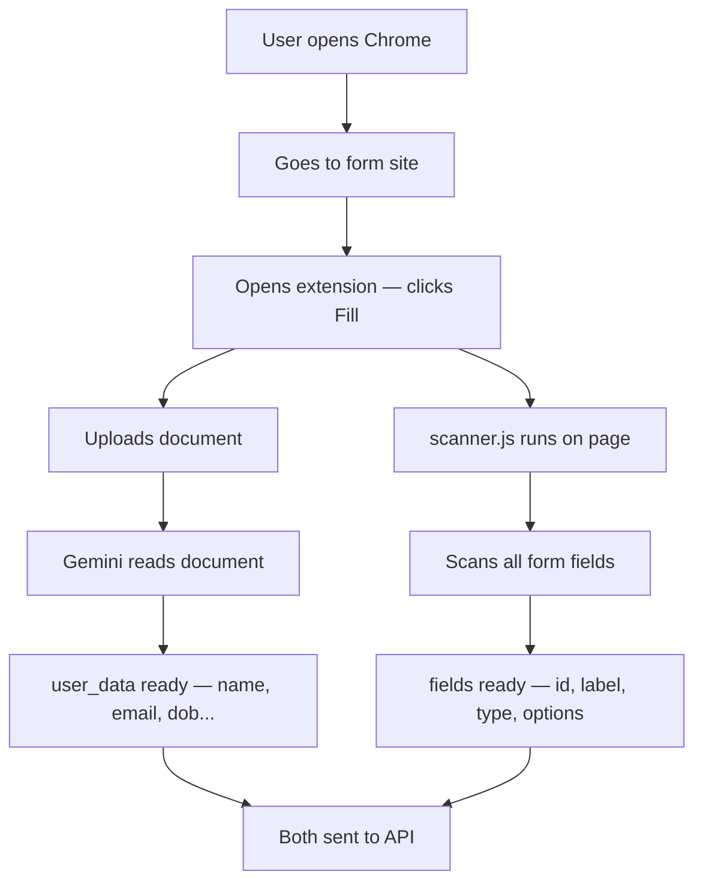
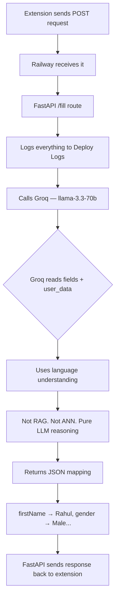
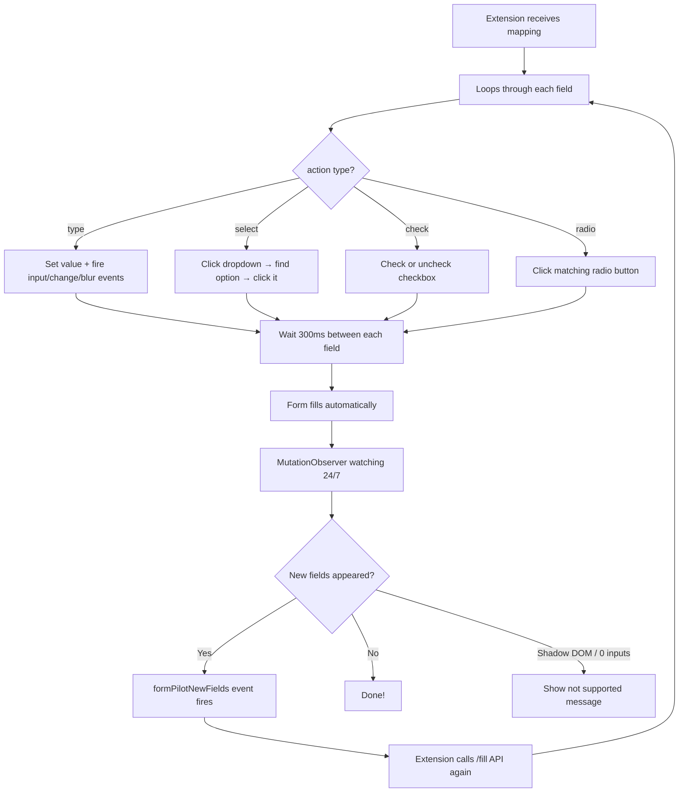

# FormPilot — Complete Flow

## Phase 1 — User Side

```mermaid
flowchart TD
    A[User opens Chrome] --> B[Goes to form site]
    B --> C[Opens extension — clicks Fill]
    C --> D[Uploads document]
    C --> E[scanner.js runs on page]
    D --> F[Gemini reads document]
    E --> G[Scans all form fields]
    F --> H[user_data ready — name, email, dob...]
    G --> I[fields ready — id, label, type, options]
    H --> J[Both sent to API]
    I --> J
```

## Phase 2 — Inside the API

```mermaid
flowchart TD
    A[Extension sends POST request] --> B[Railway receives it]
    B --> C[FastAPI /fill route]
    C --> D[Logs everything to Deploy Logs]
    D --> E[Calls Groq — llama-3.3-70b]
    E --> F{Groq reads fields + user_data}
    F --> G[Uses language understanding]
    G --> H[Not RAG. Not ANN. Pure LLM reasoning]
    H --> I[Returns JSON mapping]
    I --> J[firstName → Rahul, gender → Male...]
    J --> K[FastAPI sends response back to extension]
```

## Phase 3 — Extension Fills Form + Dynamic Fields

```mermaid
flowchart TD
    A[Extension receives mapping] --> B[Loops through each field]
    B --> C{action type?}
    C -->|type| D[Set value + fire input/change/blur events]
    C -->|select| E[Click dropdown → find option → click it]
    C -->|check| F[Check or uncheck checkbox]
    C -->|radio| G[Click matching radio button]
    D --> H[Wait 300ms between each field]
    E --> H
    F --> H
    G --> H
    H --> I[Form fills automatically]
    I --> J[MutationObserver watching 24/7]
    J --> K{New fields appeared?}
    K -->|Yes| L[formPilotNewFields event fires]
    L --> M[Extension calls /fill API again]
    M --> B
    K -->|No| N[Done!]
    K -->|Shadow DOM / 0 inputs| O[Show not supported message]
```
